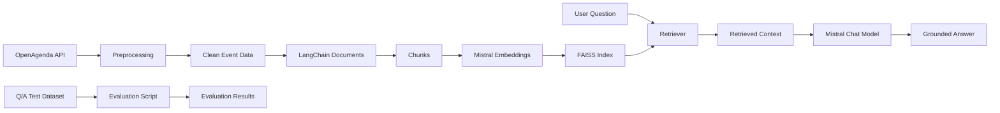

# Puls-Events RAG Assistant

## 1. Project overview

This project is a Proof of Concept for a cultural event recommendation assistant.

The system uses OpenAgenda public event data and a Retrieval-Augmented Generation architecture to answer user questions about cultural events.

The RAG pipeline is based on:

- OpenAgenda / OpenDataSoft API for event data
- Python and Pandas for data preprocessing
- Mistral embeddings for vectorization
- FAISS for vector search
- LangChain for orchestration
- Mistral chat model for answer generation
- Streamlit for the demo interface

The assistant answers only from retrieved event data. If the answer is not available in the indexed context, it should say that it does not know based on the available data.

---

## 2. Project architecture

```text
OpenAgenda API
      ↓
Preprocessing
      ↓
Clean event dataset
      ↓
LangChain Documents
      ↓
Text chunks
      ↓
Mistral embeddings
      ↓
FAISS vector index
      ↓
RAG chatbot
      ↓
CLI or Streamlit demo
````

---

## 3. Project structure

```text
2026 RAG/
│
├── app.py
├── README.md
├── requirements.txt
├── .env.example
├── .gitignore
├── pytest.ini
│
├── data/
│   ├── index/
│   │   └── faiss/
│   │       ├── index.faiss
│   │       └── index.pkl
│   └── test/
│       ├── qa_test_set.csv
│       └── evaluation_results.csv
│
├── src/
│   ├── __init__.py
│   │
│   ├── data/
│   │   ├── __init__.py
│   │   └── preprocess_openagenda.py
│   │
│   ├── index/
│   │   ├── __init__.py
│   │   └── build_faiss.py
│   │
│   ├── rag/
│   │   ├── __init__.py
│   │   └── rag_pipeline.py
│   │
│   └── evaluation/
│       ├── __init__.py
│       └── evaluate_rag.py
│
└── tests/
    └── test_data_quality.py
```

---

## 4. Installation

Create a virtual environment:

```bash
python -m venv .venv
```

Activate it:

```bash
source .venv/bin/activate
```

Install dependencies:

```bash
python -m pip install --upgrade pip
python -m pip install -r requirements.txt
```

---

## 5. Environment variables

Create a `.env` file in the project root:

```bash
cp .env.example .env
```

Then add your Mistral API key:

```env
MISTRAL_API_KEY=your_real_mistral_api_key
```

The `.env` file is ignored by Git and should never be shared.

---

## 6. Build the FAISS index

Before running the chatbot, build the FAISS index:

```bash
python -m src.index.build_faiss --city Paris --max-records 1000 --index-out data/index/faiss
```

This command:

* fetches OpenAgenda events for Paris
* cleans and filters the data
* creates LangChain documents
* splits documents into chunks
* creates Mistral embeddings
* saves the FAISS index locally

The output files are:

```text
data/index/faiss/index.faiss
data/index/faiss/index.pkl
```

`index.faiss` contains the vector search index.
`index.pkl` contains the LangChain document store and metadata.

---

## 7. Run the CLI chatbot

After building the FAISS index, run:

```bash
python -m src.rag.rag_pipeline --index data/index/faiss --k 8
```

Example questions:

```text
Recommande-moi une activité culturelle pour des enfants à Paris.
Trouve-moi un événement musical à Paris.
Y a-t-il des événements gratuits à Paris ?
Peux-tu me proposer une exposition à Paris ?
```

Type `exit` or `quit` to stop the chatbot.

---

## 8. Run the Streamlit demo

Run:

```bash
streamlit run app.py
```

Then open the local URL in the browser:

```text
http://localhost:8501
```

The Streamlit app allows the user to ask questions and displays:

* the generated answer
* the retrieved event sources
* metadata such as title, city, venue, dates, and URL

---

## 9. Run unit tests

The project includes automated data quality tests.

Run:

```bash
python -m pytest -q
```

The tests check that:

* the clean dataset is not empty
* the final schema is correct
* events belong to the selected city
* required fields are not empty
* dates are valid
* the FAISS index files exist
* the FAISS index can be loaded

Latest result:

```text
9 passed
```

---

## 10. Evaluation dataset

The project includes an annotated French Q/A dataset:

```text
data/test/qa_test_set.csv
```

It contains 15 test questions covering:

* children’s events
* family activities
* music events
* exhibitions
* free events
* nature and gardens
* workshops
* scientific and educational events
* visits
* out-of-scope city queries

---

## 11. Run RAG evaluation

Run:

```bash
python -m src.evaluation.evaluate_rag \
    --qa-file data/test/qa_test_set.csv \
    --index data/index/faiss \
    --output data/test/evaluation_results.csv
```

The script:

* reads the annotated Q/A dataset
* asks each question to the RAG system
* compares the generated answer with expected keywords
* saves the results in CSV format

Latest evaluation result:

```text
Passed: 14/15
Score: 93.33%
```

The failed case concerned an out-of-scope question about Lyon while the index was built for Paris. This highlights a limitation of the current POC and shows that stronger geographic validation would be useful in production.

---

## 12. Main commands summary

Build FAISS:

```bash
python -m src.index.build_faiss --city Paris --max-records 1000 --index-out data/index/faiss
```

Run CLI chatbot:

```bash
python -m src.rag.rag_pipeline --index data/index/faiss --k 8
```

Run Streamlit:

```bash
streamlit run app.py
```

Run tests:

```bash
python -m pytest -q
```

Run evaluation:

```bash
python -m src.evaluation.evaluate_rag \
    --qa-file data/test/qa_test_set.csv \
    --index data/index/faiss \
    --output data/test/evaluation_results.csv
```

---

## 13. Limitations

This project is a Proof of Concept, not a production system.

Main limitations:

* The FAISS index is local.
* The evaluation dataset is small.
* The system does not yet include advanced geographic validation.
* The chatbot does not manage conversation history.
* Retrieved chunks are not always perfectly deduplicated by event.
* The application depends on the availability of the Mistral API.
* A production version would require monitoring, logging, security, user feedback, and regular index updates.

---

## 14. Possible production improvements

Possible improvements include:

* using one FAISS index per city or region
* adding explicit city validation before retrieval
* deduplicating retrieved results by event ID
* adding scheduled index rebuilding
* adding user feedback collection
* monitoring answer quality and hallucination rate
* tracking latency and API cost
* deploying the app on a cloud platform
* replacing local FAISS with a managed vector database if data volume increases

---

## 15. Conclusion

This project demonstrates a functional RAG pipeline for cultural event recommendations.

The system can:

* collect recent and upcoming cultural events from OpenAgenda
* preprocess and clean event data
* build a FAISS vector index
* retrieve relevant events from user questions
* generate grounded answers using Mistral
* run as a CLI chatbot
* run as a Streamlit web demo
* evaluate answers using an annotated French Q/A dataset


---

## Architecture




